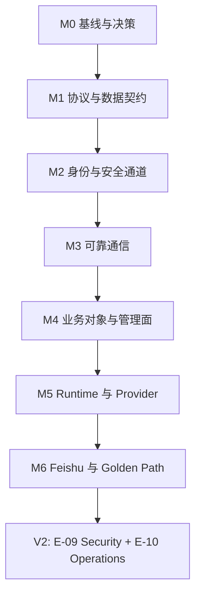

# AI Employee System — 开发任务拆分

> **用途**：单人 + AI Agent 按串行依赖推进开发的任务清单。  
> **设计基线**：[AI_Employee_System_完整技术设计与开发需求.md](./AI_Employee_System_完整技术设计与开发需求.md)（只读，下文用 `§N` 回链章节）。  
> **范围**：当前开发 **V1（M0–M6）→ V2（M7–M9）**。**V3（M10–M12）仅作路线图保留，暂不开发。**

---

# 0. 如何使用本文档

## 0.1 ID 规则

| 层级 | 格式 | 示例 |
|------|------|------|
| Epic | `E-NN` | `E-01` Foundation |
| Story | `S-NNMM` | `S-0101`（Epic 01 的第 01 个 Story） |
| Task | `T-NNMM` | `T-0103`（Epic 01 的第 03 个 Task） |

Task ID 全局唯一。依赖字段只引用 Task ID（如 `T-0102, T-0205`）。

## 0.2 状态标记

在 Task 标题后可追加状态（默认全部为待办）：

- `[ ]` 待办
- `[~]` 进行中
- `[x]` 已完成
- `[-]` 已取消 / 移出版本范围 / **暂缓（如 V3）**

## 0.3 Task 字段约定

每个 Task 必须包含：

- **Epic** / **Milestone**
- **依赖**：前置 Task ID；无依赖写 `无`
- **设计依据**：设计文档章节号
- **产出物**：具体路径或可检查的交付物
- **验收标准**：可验证的条目（非模糊描述）
- **风险/备注**（可选）

## 0.4 与设计文档的关系

- 设计文档的 **Epic 1–10（§135）** 作为归类标签保留；V3 增补 **E-11 Isolation / E-12 Scale / E-13 Domain**（设计文档未单独编号，本清单补齐）。
- 设计文档的 **Phase 1–15（§101）** 不直接作为执行顺序；执行顺序以本文 **里程碑 M0–M12** 为准。
- 实现时若与设计文档冲突，以「待决策问题」（第 6 章）先拍板，再改设计基线或本任务清单。

## 0.5 推荐执行方式

1. 先关闭第 6 章中阻塞当前里程碑的决策项。
2. 按里程碑串行：`M0 → … → M6（V1）→ M7 → M8 → M9（V2）`。**到 M9 为止；不进入 M10+。**
3. 同一里程碑内按 Task 依赖拓扑执行；无依赖的 Task 可并行（单人场景通常仍串行）。
4. 每个 Task 完成后勾选状态，并用验收标准自检。
5. M6 结束后跑第 4 章 V1 Golden Path；M9 跑第 5 章 V2 验收（§5.4）。V3 验收（§5.5）暂不执行。

---

# 1. 里程碑总览

| 里程碑 | 名称 | 主要 Epic | 目标一句话 |
|--------|------|-----------|------------|
| **M0** | 基线与决策 | E-01 | 锁定技术栈、仓库约定、CI 骨架、关闭阻塞决策 |
| **M1** | 协议与数据契约 | E-01 | proto 唯一来源 + PostgreSQL migrations + SQLite schema |
| **M2** | 身份与安全通道 | E-02 | User/Auth、Workstation Enrollment、mTLS、gRPC 打通 |
| **M3** | 可靠通信 | E-08 | Heartbeat、sequence/ACK、Outbox、Resume、Reconnect、防 Replay |
| **M4** | 业务对象与管理面 | E-03, E-04 | Employee/WS/Workspace/Session/Job/Message + Admin + SSE |
| **M5** | Runtime 与 Provider | E-06, E-07 | Daemon、IPC、CLI、Provider/ACP、Cursor、Codex |
| **M6** | Feishu 与 Golden Path | E-05 | 飞书接入、Scheduler、端到端闭环、Recovery 测试 |



---

# 2. Epic 与里程碑映射

| Epic | 名称 | V1 里程碑 | 说明 |
|------|------|-----------|------|
| E-01 | Foundation | M0, M1 | Monorepo、proto、DB、Docker、CI |
| E-02 | Identity | M2 | User、Workstation Identity、证书、mTLS |
| E-03 | Control Plane | M4 | Employee/WS/Workspace/Job/Session/Message 服务 |
| E-04 | Admin | M4 | Admin Web 登录与页面、SSE |
| E-05 | Feishu | M6 | Bot、事件、幂等、Resolver、回复 |
| E-06 | Workstation | M5 | Daemon、CLI、SQLite、IPC、Runtime |
| E-07 | Agent | M5 | Provider 接口、Installer、ACP、Cursor、Codex |
| E-08 | Reliability | M3 | ACK、sequence、Outbox、Resume、Recovery、Reconnect |
| E-09 | Security | V2 | Permission Engine、Approval、TOTP、Secret、高级 Audit |
| E-10 | Operations | V2 | Update/Rollback、Diagnostics、Metrics、Artifact |

> **注意**：E-08 在设计文档 §135 排在 Agent 之后，但本清单将其提前到 M3（Job 之前），避免状态机与通信层返工。

---

# 3. Epic 详细拆分

---

## E-01 Foundation

### S-0101 Monorepo 与工程约定 — Milestone: M0

#### T-0101 [x] 初始化 Monorepo 目录骨架

- **Epic**: E-01 Foundation
- **Milestone**: M0
- **依赖**: 无
- **设计依据**: §102, §134
- **产出物**:
  - `server/`、`workstation/`、`admin/`、`proto/`、`migrations/`、`deploy/`、`docs/`、`scripts/`
  - 根 `README.md`、`Makefile`、`.gitignore`（扩展现有）
- **验收标准**:
  - 目录结构与 §134 一致（可无业务代码，但路径存在）
  - `README.md` 说明如何构建 server / workstation / admin
- **风险/备注**: 不把 Cursor 写死进 Job；业务代码后续再填

#### T-0102 [x] 建立 Go Modules（server + workstation）

- **Epic**: E-01
- **Milestone**: M0
- **依赖**: T-0101
- **设计依据**: §72, §73, §74, §75
- **产出物**:
  - `server/go.mod`
  - `workstation/go.mod`
  - 可选 workspace：`go.work`
- **验收标准**:
  - `cd server && go mod tidy` 成功
  - `cd workstation && go mod tidy` 成功
  - Go 版本在 README / go.mod 中锁定（建议 Go 1.22+）

#### T-0103 [x] 建立 Admin 前端工程

- **Epic**: E-01
- **Milestone**: M0
- **依赖**: T-0101
- **设计依据**: §72, §76
- **产出物**:
  - `admin/package.json`（React + TypeScript）
  - 基础 `src/` 目录：`pages/`、`components/`、`api/`、`stores/`、`router/`
- **验收标准**:
  - `npm install` / `pnpm install` 成功
  - `npm run build`（或等价）能产出空壳应用
  - 技术栈版本写进 README

#### T-0104 [x] 锁定技术栈与版本基线文档

- **Epic**: E-01
- **Milestone**: M0
- **依赖**: T-0102, T-0103
- **设计依据**: §71–§73, §80
- **产出物**: `docs/STACK.md`（或 README 专节）
- **验收标准**:
  - 明确：Go、PostgreSQL、React/TS、gRPC、proto 工具链、Docker Compose 版本
  - V1 明确：**不引入 Redis**（§71, §85）
  - 配置策略：default + overlay（§80）写明路径约定

#### T-0105 [x] CI 骨架

- **Epic**: E-01
- **Milestone**: M0
- **依赖**: T-0102, T-0103
- **设计依据**: §135 Epic 1, §136
- **产出物**: `.github/workflows/ci.yml`（或等价）
- **验收标准**:
  - PR/push 触发：`go test`（server/workstation 空测可先过）、`admin` lint/build、`make proto`（M1 后强制）
  - CI 失败即阻断合并

#### T-0106 [x] 关闭 M0 阻塞决策并记录结论

- **Epic**: E-01
- **Milestone**: M0
- **依赖**: 无（可与 T-0101 并行）
- **设计依据**: 本文第 6 章；§11, §16, §51, §120
- **产出物**: `docs/DECISIONS.md`（或在本文第 6 章直接填「结论」列）
- **验收标准**:
  - 至少关闭：Feishu Employee 身份模型（Q-02）、V1 max_sessions（Q-03）、`aew daemon` CLI（Q-05）
  - 未关闭项标注「不阻塞 M1/M2」或明确阻塞里程碑

---

### S-0102 Proto 协议定义 — Milestone: M1

#### T-0107 [x] 搭建 proto 工具链与生成脚本

- **Epic**: E-01
- **Milestone**: M1
- **依赖**: T-0102, T-0104
- **设计依据**: §103
- **产出物**:
  - `proto/` 目录
  - `Makefile` 目标：`proto` / `proto-lint`
  - buf 或 protoc + Go 插件配置
- **验收标准**:
  - `make proto` 可重复执行，生成物路径固定
  - 生成物可提交或由 CI 校验「git diff 干净」

#### T-0108 [x] 定义 common.proto

- **Epic**: E-01
- **Milestone**: M1
- **依赖**: T-0107
- **设计依据**: §21, §65, §66, §103, §128
- **产出物**: `proto/common.proto`
- **验收标准**:
  - 公共字段：`message_id`、`sequence`、`timestamp`、`nonce` 等可复用 message/enum
  - 时间戳语义与 clock skew 注释齐全（§128）

#### T-0109 [x] 定义 workstation.proto / heartbeat.proto

- **Epic**: E-01
- **Milestone**: M1
- **依赖**: T-0108
- **设计依据**: §18, §67, §94, §103
- **产出物**: `proto/workstation.proto`, `proto/heartbeat.proto`
- **验收标准**:
  - Heartbeat 含：workstation_id、timestamp、version、cpu、memory、disk、employees、sessions、capabilities
  - Workstation 状态枚举覆盖：PROVISIONING / ONLINE / BUSY / DRAINING / OFFLINE / ERROR（§18）

#### T-0110 [x] 定义 command.proto / event.proto

- **Epic**: E-01
- **Milestone**: M1
- **依赖**: T-0108
- **设计依据**: §65, §66, §103
- **产出物**: `proto/command.proto`, `proto/event.proto`
- **验收标准**:
  - Command 含：command_id、workstation_id、employee_id、job_id、type、payload、sequence、timestamp、nonce
  - Command 类型至少：START_JOB、STOP_JOB、START_SESSION、STOP_SESSION、INSTALL_PROVIDER、UPDATE_PROVIDER、SYNC_WORKSPACE、UPDATE_WORKSTATION
  - Event 类型至少：SESSION_*、JOB_*、PROVIDER_*、WORKSPACE_CHANGED、SYSTEM_ALERT（§66）

#### T-0111 [x] 定义 job.proto / session.proto

- **Epic**: E-01
- **Milestone**: M1
- **依赖**: T-0108
- **设计依据**: §15, §51, §52, §103, §112, §113
- **产出物**: `proto/job.proto`, `proto/session.proto`
- **验收标准**:
  - Job 状态枚举含正常链与异常：CREATED/QUEUED/ASSIGNED/STARTING/RUNNING/SUCCESS + FAILED/CANCELLED/TIMEOUT/BLOCKED/WAITING_APPROVAL/UNKNOWN
  - Session 状态：STARTING/READY/BUSY/IDLE/STOPPING/STOPPED/ERROR
  - Job Context 字段覆盖 §112

#### T-0112 [x] 定义 Control Plane ↔ Workstation gRPC 服务

- **Epic**: E-01
- **Milestone**: M1
- **依赖**: T-0109, T-0110, T-0111
- **设计依据**: §64, §20
- **产出物**: `proto/worker_service.proto`（名称可调整）
- **验收标准**:
  - Workstation **主动出站**连接（双向流或等价），不要求 WS 暴露公网 HTTP
  - 服务方法覆盖：Connect/Resume、Heartbeat、Command 下发、Event 上报、ACK
  - `make proto` 生成 server/workstation 两侧 stub

---

### S-0103 PostgreSQL Migrations — Milestone: M1

#### T-0113 [x] 搭建 migration 工具链

- **Epic**: E-01
- **Milestone**: M1
- **依赖**: T-0102
- **设计依据**: §104, §71
- **产出物**:
  - `migrations/` + `server/cmd/migrate`
  - 工具选型（golang-migrate / goose 等）写进 STACK
- **验收标准**:
  - `migrate up` / `migrate down` 可对本地 Postgres 执行
  - **禁止**应用启动时自动改 schema（§104）

#### T-0114 [x] users / roles / permissions 表

- **Epic**: E-01
- **Milestone**: M1
- **依赖**: T-0113
- **设计依据**: §26, §27, §78
- **产出物**: `migrations/000001_users_rbac.sql`（编号可按工具约定）
- **验收标准**:
  - users：密码哈希字段（Argon2id/bcrypt）、失败计数、锁定至时间
  - roles / permissions / 关联表支持 SUPER_ADMIN/ADMIN/OPERATOR/VIEWER
  - 权限字符串可覆盖 §27 示例集

#### T-0115 [x] employees 及相关绑定表

- **Epic**: E-01
- **Milestone**: M1
- **依赖**: T-0113
- **设计依据**: §2, §26, §32, §33, §82
- **产出物**: employees、employee_skills、employee_knowledge、employee_feishu_bindings migrations
- **验收标准**:
  - Employee 核心字段：id、name、描述、职责、provider、workstation、workspace、permission/runtime/session policy、status
  - Feishu binding 表存在；Skill/Knowledge 关联表存在（内容管理可后补）

#### T-0116 [x] workstations / certificates / workspaces 表

- **Epic**: E-01
- **Milestone**: M1
- **依赖**: T-0113
- **设计依据**: §18, §26, §50, §126
- **产出物**: workstations、workstation_certificates、workspaces migrations
- **验收标准**:
  - Workstation 含 status、capabilities、last_heartbeat、证书关联
  - Workspace 含 workspace_id、employee_id、path、repository、branch、permission_policy

#### T-0117 [x] jobs / job_events / sessions / messages / conversations 表

- **Epic**: E-01
- **Milestone**: M1
- **依赖**: T-0113
- **设计依据**: §14, §15, §26, §83, §84, §112, §113
- **产出物**: 对应 migrations
- **验收标准**:
  - jobs 含 idempotency_key 唯一约束
  - job_events 可支撑 Timeline（§113）
  - messages 含 sender_type/receiver_type；conversations 表存在
  - 飞书去重字段可存 event_id / message_id（§83）

#### T-0118 [x] providers / audit / system_config 及 V1 占位表

- **Epic**: E-01
- **Milestone**: M1
- **依赖**: T-0113
- **设计依据**: §26, §31, §38, §81
- **产出物**: providers、provider_versions、provider_installations、audit_logs、system_config；approval/secrets/artifacts 可为空壳表或延后到 V2 migration
- **验收标准**:
  - audit_logs 字段对齐 §31
  - system_config 可存非 Secret 配置；Feishu Secret 不进明文列（§81）
  - Provider registry 表结构具备 version/os/arch/url/sha256/signature 字段（安装逻辑可 V2）

---

### S-0104 Workstation SQLite Schema — Milestone: M1

#### T-0119 [x] Workstation SQLite schema 与迁移

- **Epic**: E-01
- **Milestone**: M1
- **依赖**: T-0102
- **设计依据**: §25, §53, §23
- **产出物**:
  - `workstation/internal/...` 下 schema SQL 或 embed migrations
  - 表：workstation_state、employees、workspaces、sessions、jobs、job_events、server_commands、worker_events、outbox、provider_installations、updates
- **验收标准**:
  - 新库初始化一次成功；幂等可重复执行
  - outbox / server_commands 支持 sequence 与 ACK 语义字段
  - agent_sessions 字段对齐 §53

---

### S-0105 Docker 与本地开发环境 — Milestone: M1

#### T-0120 [x] docker-compose：Postgres + Control Plane 占位 + Admin 占位

- **Epic**: E-01
- **Milestone**: M1
- **依赖**: T-0113, T-0103
- **设计依据**: §71, §134
- **产出物**:
  - `deploy/docker-compose.yml`
  - `deploy/Dockerfile.server`、`deploy/Dockerfile.admin`（可先跑 hello）
- **验收标准**:
  - `docker compose up` 启动 Postgres；migrate 可连上
  - V1 **无 Redis** 服务
  - 文档说明本地开发端口与环境变量

#### T-0121 [x] M1 契约冻结检查清单

- **Epic**: E-01
- **Milestone**: M1
- **依赖**: T-0112, T-0118, T-0119, T-0120
- **设计依据**: §103, §104, §133
- **产出物**: `docs/CONTRACT_CHECKLIST.md` 或本文勾选记录
- **验收标准**:
  - proto 为通信结构唯一来源（无手写重复结构）
  - migrations 可在干净库一键 up
  - SQLite schema 与 proto/job/session 概念对齐无致命矛盾

---

## E-02 Identity

### S-0201 Admin User 认证 — Milestone: M2

#### T-0201 [x] Auth 服务：登录 / Session 或 JWT / 登出

- **Epic**: E-02 Identity
- **Milestone**: M2
- **依赖**: T-0114, T-0120
- **设计依据**: §78, §79
- **产出物**: `server/internal/auth/`，`POST /api/auth/login` 等
- **验收标准**:
  - 密码使用 Argon2id 或 bcrypt
  - IP + User Rate Limit、失败计数、临时锁定（非永久）
  - 登录成功/失败写 Audit Log
- **风险/备注**: Approval TOTP 属 V2；登录本身不要求 TOTP

#### T-0202 [x] RBAC 中间件

- **Epic**: E-02
- **Milestone**: M2
- **依赖**: T-0201
- **设计依据**: §27, §88
- **产出物**: 权限检查中间件 + 种子角色数据
- **验收标准**:
  - 无权限返回 403；未登录 401
  - 至少一种角色可端到端验证（如 VIEWER 只读）

---

### S-0202 Workstation Enrollment 与证书 — Milestone: M2

#### T-0203 [x] Enrollment Token 签发与校验（Control Plane）

- **Epic**: E-02
- **Milestone**: M2
- **依赖**: T-0116, T-0201
- **设计依据**: §19, §125
- **产出物**: Admin/API 创建一次性 enrollment token；校验接口
- **验收标准**:
  - Token 一次性或短时有效
  - 校验失败不可签发证书
  - 操作进 Audit Log

#### T-0204 [x] Workstation 本地 Identity 生成

- **Epic**: E-02
- **Milestone**: M2
- **依赖**: T-0119
- **设计依据**: §19, §45–§48, §125
- **产出物**: `workstation/internal/identity/`；PlatformPaths 接口与 Windows/Linux/Darwin 实现骨架
- **验收标准**:
  - 生成 workstation_id、私钥、CSR
  - 私钥**永不上传** Control Plane
  - 路径通过 PlatformPaths，业务代码无硬编码盘符（§48）

#### T-0205 [x] CA 签发 Client Certificate + 吊销清单

- **Epic**: E-02
- **Milestone**: M2
- **依赖**: T-0203, T-0204
- **设计依据**: §19, §20, §126, §88
- **产出物**: Control Plane 证书服务；workstation_certificates 写入；REVOKE API
- **验收标准**:
  - Enrollment 成功后本地保存 client.crt / client.key
  - 吊销后该证书无法通过 mTLS
  - 证书状态：ENROLL → ACTIVE → RENEW → EXPIRED / REVOKE

#### T-0206 [x] `aew register` / `unregister` CLI

- **Epic**: E-02
- **Milestone**: M2
- **依赖**: T-0205
- **设计依据**: §19, §40
- **产出物**: workstation CLI 子命令
- **验收标准**:
  - `aew register --server ... --token ...` 完成 enrollment
  - 之后连接不再依赖 enrollment token
  - unregister 可吊销/清理本地 identity（语义写清）

---

### S-0203 mTLS + gRPC 通道 — Milestone: M2

#### T-0207 [x] Control Plane gRPC Server（mTLS）

- **Epic**: E-02
- **Milestone**: M2
- **依赖**: T-0112, T-0205
- **设计依据**: §20, §64, §88
- **产出物**: `server` gRPC 入口；TLS 1.3；客户端证书校验
- **验收标准**:
  - 无客户端证书拒绝连接
  - 非法/吊销证书拒绝连接
  - 合法证书可建立双向流

#### T-0208 [x] Workstation gRPC Client（出站连接）

- **Epic**: E-02
- **Milestone**: M2
- **依赖**: T-0207, T-0206
- **设计依据**: §64, §20
- **产出物**: `workstation/internal/controlplane/grpc`
- **验收标准**:
  - Workstation 主动连 Control Plane
  - 加载本地 client 证书
  - 基础 RPC（如 Ping/Hello）往返成功

#### T-0209 [x] M2 安全通道验收

- **Epic**: E-02
- **Milestone**: M2
- **依赖**: T-0202, T-0208
- **设计依据**: §132 Security
- **产出物**: 集成测试或脚本 `scripts/verify_mtls.sh`
- **验收标准**:
  - Admin 登录可用
  - register → mTLS → ping 成功
  - 非法证书无法连接

---

## E-08 Reliability

> 提前至 M3，在业务 Job 之前完成。

### S-0801 Sequence / ACK / 防 Replay — Milestone: M3

#### T-0801 [x] Server→Workstation Command 序号与持久化

- **Epic**: E-08 Reliability
- **Milestone**: M3
- **依赖**: T-0208, T-0119
- **设计依据**: §21, §22, §65, §129
- **产出物**: sequence 分配；Workstation `server_commands` 表写入
- **验收标准**:
  - sequence 单调；`sequence <= last_sequence` → REJECT
  - 相同 command_id 幂等（不重复执行）
  - timestamp 超窗 REJECT

#### T-0802 [x] ACK 语义：本地 SQLite COMMIT 后才 ACK

- **Epic**: E-08
- **Milestone**: M3
- **依赖**: T-0801
- **设计依据**: §22
- **产出物**: ACK 协议处理与测试
- **验收标准**:
  - COMMIT 失败不发送 ACK
  - 崩溃恢复后未 ACK 命令可重投且幂等

#### T-0803 [x] Workstation→Server Event 序号与幂等

- **Epic**: E-08
- **Milestone**: M3
- **依赖**: T-0801
- **设计依据**: §21, §66, §83
- **产出物**: Event 上报与 Server 侧去重
- **验收标准**:
  - 重复 event_id / message_id 幂等成功
  - 乱序策略有明确文档（拒绝或缓冲）

---

### S-0802 Outbox / Resume / Reconnect — Milestone: M3

#### T-0804 [x] Outbox Dispatcher

- **Epic**: E-08
- **Milestone**: M3
- **依赖**: T-0803, T-0119
- **设计依据**: §23
- **产出物**: outbox 表 + 发送循环
- **验收标准**:
  - 断网时 Event 写入 SQLite，不丢
  - 网络恢复后自动发送并标记完成

#### T-0805 [x] Resume：告知 Server 最后确认 sequence

- **Epic**: E-08
- **Milestone**: M3
- **依赖**: T-0802, T-0804
- **设计依据**: §24, §68
- **产出物**: Connect/Resume RPC 实现
- **验收标准**:
  - Resume 后 Server 从 N+1 续传未确认 Command
  - 集成测试：断连 → 重连 → 状态一致

#### T-0806 [x] Reconnect 指数退避

- **Epic**: E-08
- **Milestone**: M3
- **依赖**: T-0208
- **设计依据**: §127
- **产出物**: `reconnect` 模块；最大退避可配置
- **验收标准**:
  - 状态：CONNECTED → DISCONNECTED → RECONNECTING → CONNECTED
  - 退避 1s/2s/4s/... 有上限

#### T-0807 [x] Heartbeat 与 Offline 判定

- **Epic**: E-08
- **Milestone**: M3
- **依赖**: T-0109, T-0208
- **设计依据**: §67, §91
- **产出物**: Heartbeat 发送与 Server 超时标记 OFFLINE
- **验收标准**:
  - 默认约 5s 心跳、约 15s 无心跳 → OFFLINE（时间可配置）
  - Offline 后 Scheduler（M6）不得分配新 Job；已有 RUNNING → UNKNOWN（不立即 FAILED）

#### T-0808 [x] M3 可靠性测试套件

- **Epic**: E-08
- **Milestone**: M3
- **依赖**: T-0805, T-0806, T-0807
- **设计依据**: §136, §89, §90
- **产出物**: `workstation/tests` + `server/tests` 协议/恢复用例
- **验收标准**:
  - 覆盖：断网、Server 重启、Workstation 重启、Duplicate Command、Replay、Out-of-order（至少记录策略）
  - CI 可跑通核心用例

---

## E-03 Control Plane（业务对象）

### S-0301 Employee / Workstation / Workspace CRUD — Milestone: M4

#### T-0301 [x] Employee 服务与 REST API

- **Epic**: E-03 Control Plane
- **Milestone**: M4
- **依赖**: T-0115, T-0202
- **设计依据**: §2, §10, §105
- **产出物**: `server/internal/employee/`；CRUD API
- **验收标准**:
  - 创建/修改/停用/删除；绑定 Workstation、Workspace、Provider
  - Employee ≠ 进程；可无 Active Session
  - 写操作进 Audit Log

#### T-0302 [x] Workstation 管理 API（只读为主 + 吊销）

- **Epic**: E-03
- **Milestone**: M4
- **依赖**: T-0116, T-0205, T-0807
- **设计依据**: §18, §105
- **产出物**: GET list/detail；revoke；状态来自心跳
- **验收标准**:
  - 列表展示 ONLINE/OFFLINE/BUSY 等与 last_heartbeat
  - 吊销证书后连接断开

#### T-0303 [x] Workspace 服务与绑定

- **Epic**: E-03
- **Milestone**: M4
- **依赖**: T-0116, T-0301
- **设计依据**: §50, §120
- **产出物**: Workspace CRUD + Employee 绑定
- **验收标准**:
  - 路径/仓库/分支字段完整
  - V1 Workspace Lock 策略有文档（参见 Q-01）

---

### S-0302 Session / Job / Message — Milestone: M4

#### T-0304 [x] Session 领域模型与 API

- **Epic**: E-03
- **Milestone**: M4
- **依赖**: T-0117, T-0301
- **设计依据**: §3, §16, §51, §52
- **产出物**: Session 服务；状态机实现
- **验收标准**:
  - V1：每 Employee 最多一个 Active Session（与决策 Q-03 一致）
  - 状态转换合法；非法转换拒绝

#### T-0305 [x] Job 服务、状态机、幂等创建

- **Epic**: E-03
- **Milestone**: M4
- **依赖**: T-0117, T-0304
- **设计依据**: §15, §84, §92, §112, §113
- **产出物**: Job CRUD/cancel；job_events 写入
- **验收标准**:
  - 相同 idempotency_key 不创建双 Job
  - 状态机含异常态；WAITING_APPROVAL/UNKNOWN 出边按决策文档实现（Q-04）
  - Timeout 字段存在（真正超时停 Session 可在 M5/M6 完成）

#### T-0306 [x] Message / Conversation 服务

- **Epic**: E-03
- **Milestone**: M4
- **依赖**: T-0117
- **设计依据**: §14, §13, §111
- **产出物**: Message Bus 服务
- **验收标准**:
  - sender_type：USER / EMPLOYEE / SYSTEM
  - receiver_type：EMPLOYEE / USER / GROUP / SYSTEM
  - 支持 Employee→Employee 消息（不限于 User→Employee）

#### T-0307 [x] 内部 Event Bus（进程内 + DB）

- **Epic**: E-03
- **Milestone**: M4
- **依赖**: T-0305
- **设计依据**: §85, §77
- **产出物**: Go 内部 Event Bus；持久化关键事件
- **验收标准**:
  - V1 无 NATS/Kafka/Redis Streams
  - Admin SSE（T-0406）可订阅关键状态变更

---

## E-04 Admin

### S-0401 Admin 壳与登录 — Milestone: M4

#### T-0401 [x] Admin 布局、路由、登录页

- **Epic**: E-04 Admin
- **Milestone**: M4
- **依赖**: T-0103, T-0201
- **设计依据**: §8, §78
- **产出物**: `admin/src` 登录与受保护路由
- **验收标准**:
  - 登录后持有 session/JWT；刷新保持登录（或明确重新登录）
  - 未登录无法访问业务页

#### T-0402 [x] Dashboard 页（含实时刷新入口）

- **Epic**: E-04
- **Milestone**: M4
- **依赖**: T-0401, T-0302, T-0305
- **设计依据**: §9, §106
- **产出物**: Dashboard 页面
- **验收标准**:
  - 展示 Employees / Workstations / Jobs 计数与 Active Jobs / Workstation 状态
  - 支持轮询或 SSE 刷新（SSE 见 T-0406）

#### T-0403 [x] Employees / Workstations / Jobs / Sessions 页面

- **Epic**: E-04
- **Milestone**: M4
- **依赖**: T-0301–T-0305, T-0401
- **设计依据**: §10, §114, §105
- **产出物**: 列表 + 详情；Job Timeline
- **验收标准**:
  - Employee 详情分区对齐 §10（Feishu/Skills 等可先占位）
  - Job 详情展示 Timeline（§114）
  - 所有写操作走 REST，不直连 DB（§77）

#### T-0404 [x] Audit Logs / Settings 基础页

- **Epic**: E-04
- **Milestone**: M4
- **依赖**: T-0401, T-0118
- **设计依据**: §31, §8
- **产出物**: Audit 只读列表；System Settings 只读/基础编辑
- **验收标准**:
  - 可按时间/actor/action 过滤（最小可用）
  - Secret 类配置不在前端明文回显

#### T-0405 [x] Feishu / Skills / Knowledge / Approvals / Secrets / Artifacts 占位页

- **Epic**: E-04
- **Milestone**: M4
- **依赖**: T-0401
- **设计依据**: §8, §98（V1 范围）
- **产出物**: 路由与空状态页
- **验收标准**:
  - 导航存在，标注「V1 部分可用 / V2」
  - Feishu 配置页在 M6（T-0501）接真 API

#### T-0406 [x] SSE 实时推送

- **Epic**: E-04
- **Milestone**: M4
- **依赖**: T-0307, T-0402
- **设计依据**: §77, §106
- **产出物**: `GET /api/events`（SSE）；Admin 订阅
- **验收标准**:
  - 推送：Workstation Online/Offline、Job Progress、Session Status、System Alert
  - V1 不强制 WebSocket

---

## E-06 Workstation Runtime

### S-0601 Daemon、IPC、CLI — Milestone: M5

#### T-0601 [x] Agent Daemon 启动与恢复流水线

- **Epic**: E-06 Workstation
- **Milestone**: M5
- **依赖**: T-0805, T-0119, T-0208
- **设计依据**: §123, §68, §89
- **产出物**: `aew daemon`（或 service 入口）；启动：Load Config → Identity → SQLite → Recover → Connect → Heartbeat → Ready
- **验收标准**:
  - CLI 退出后 Daemon 仍运行（经 Service 或后台进程）
  - 重启后恢复 Sessions/Jobs/Outbox（未知态不标 SUCCESS，§53）

#### T-0602 [x] Local IPC（Named Pipe / UDS）

- **Epic**: E-06
- **Milestone**: M5
- **依赖**: T-0601
- **设计依据**: §44, §122
- **产出物**: `LocalTransport` 接口 + Windows/Unix 实现
- **验收标准**:
  - CLI 经 IPC 与 Daemon 通信，不直接读写 SQLite 做核心状态变更
  - 权限：仅本机授权用户可连接（文档说明）

#### T-0603 [x] CLI 命令树（V1 必需子集）

- **Epic**: E-06
- **Milestone**: M5
- **依赖**: T-0602, T-0206
- **设计依据**: §40–§43, §41, §42
- **产出物**: version/status/ping/doctor/logs/register/reconnect/service/employee/workspace/agent/session/job/config 等
- **验收标准**:
  - `aew status` / `aew ping` / `aew doctor` 输出对齐 §41–§43 关键字段
  - ping 走 Control Plane 往返，非 ICMP
  - `daemon` 子命令与 §40 命令树一致性按 Q-05 决策落地

#### T-0604 [x] OS Service 安装（Windows Service / systemd / launchd）

- **Epic**: E-06
- **Milestone**: M5
- **依赖**: T-0601
- **设计依据**: §69
- **产出物**: `aew service install|start|stop|restart|status`
- **验收标准**:
  - 至少在一个目标平台（优先 Windows）可装服务并开机启动
  - 其他平台接口存在，可返回「未实现」但结构统一

---

### S-0602 Runtime Managers — Milestone: M5

#### T-0605 [x] Process Manager（禁止任意 Shell）

- **Epic**: E-06
- **Milestone**: M5
- **依赖**: T-0601
- **设计依据**: §116, §60, §88
- **产出物**: `ProcessManager` 接口：Start/Stop/Inspect
- **验收标准**:
  - 无「执行任意命令」API
  - 仅允许白名单业务进程规格启动 Provider

#### T-0606 [x] Employee / Workspace / Session / Job Manager（本地）

- **Epic**: E-06
- **Milestone**: M5
- **依赖**: T-0605, T-0801, T-0305
- **设计依据**: §39, §49, §54, §56, §120
- **产出物**: runtime 包：接收 Command → 启停 Session → 跑 Job → 发 Event
- **验收标准**:
  - Employee 本地目录以 Employee ID 为键（§49）
  - 按需启动：无 Job 时可不跑 Cursor（§54）
  - Workspace Lock：同 Workspace 不同时写（策略见 Q-01）

#### T-0607 [x] Recovery Manager（最小集）

- **Epic**: E-06
- **Milestone**: M5
- **依赖**: T-0606
- **设计依据**: §57, §53, §91
- **产出物**: 崩溃/断连/进程消失处理
- **验收标准**:
  - PID 不存在 → Session/Job UNKNOWN，触发恢复或上报，不标 SUCCESS
  - 覆盖：Process Crash、ACP Disconnect、Network unavailable（最小）

#### T-0608 [x] Monitor（心跳指标，不高频写库）

- **Epic**: E-06
- **Milestone**: M5
- **依赖**: T-0807
- **设计依据**: §115, §67
- **产出物**: CPU/Memory/Disk 采集进 Heartbeat
- **验收标准**:
  - 指标经 Heartbeat 上报，不每秒写 PostgreSQL
  - `aew status` 显示本地采样值

---

## E-07 Agent

### S-0701 Provider 抽象与 ACP — Milestone: M5

#### T-0701 [x] AgentProvider / ProviderInstaller 接口

- **Epic**: E-07 Agent
- **Milestone**: M5
- **依赖**: T-0605
- **设计依据**: §36, §37, §117, §133
- **产出物**: `providers/interface.go`；Installer 与 Provider 分离
- **验收标准**:
  - 接口含 Detect/Install/Uninstall/Update/Start/Stop/Status
  - JobManager **不**直接依赖 Cursor 类型

#### T-0702 [x] ACP Client 与 AgentSession 抽象

- **Epic**: E-07
- **Milestone**: M5
- **依赖**: T-0701
- **设计依据**: §35, §117, §118
- **产出物**: `acp` 包；`AgentSession`：Start/Send/Events/Stop
- **验收标准**:
  - 链路：SessionManager → Provider → ACP → Agent
  - 单元测试可用 Fake Provider/ACP

#### T-0703 [x] Cursor Provider + Installer（V1）

- **Epic**: E-07
- **Milestone**: M5
- **依赖**: T-0702
- **设计依据**: §36–§38, §98, §118, §119
- **产出物**: `providers/cursor`
- **验收标准**:
  - Detect / Start / Stop / Status 可用（Install 可先支持「已安装检测」；完整 Registry 下载可降级为本地路径配置）
  - 启动后完成 ACP Handshake → Session READY
  - Provider 生命周期状态机 §119

#### T-0704 [x] Codex Provider + Installer（V1）

- **Epic**: E-07
- **Milestone**: M5
- **依赖**: T-0702
- **设计依据**: §36, §98
- **产出物**: `providers/codex`
- **验收标准**:
  - 与 Cursor 同等接口；至少一个平台可 Detect+Start（或明确文档限制）
  - Job 选择 Provider 由 Employee 配置决定，非硬编码

#### T-0705 [x] Provider 配置与本地安装状态持久化

- **Epic**: E-07
- **Milestone**: M5
- **依赖**: T-0703, T-0119
- **设计依据**: §38, §124, §95
- **产出物**: config.yaml providers 段；SQLite provider_installations
- **验收标准**:
  - 敏感信息不进 YAML（§124）
  - capabilities（ACP/MCP/headless）可上报 Heartbeat

---

## E-05 Feishu

### S-0501 Feishu 接入 — Milestone: M6

#### T-0501 [x] Feishu 配置与 Secret 引用

- **Epic**: E-05 Feishu
- **Milestone**: M6
- **依赖**: T-0405, T-0118
- **设计依据**: §81, §62, §88
- **产出物**: Admin Feishu 配置 API；Secret 不进明文 DB
- **验收标准**:
  - App ID / Secret / Verification Token / Encrypt Key 可配置
  - Secret 仅存引用或加密存储；不进 Prompt/普通日志

#### T-0502 [x] Webhook：验签、解析、去重

- **Epic**: E-05
- **Milestone**: M6
- **依赖**: T-0501, T-0306
- **设计依据**: §83, §107, §108
- **产出物**: `POST /api/integrations/feishu/events`
- **验收标准**:
  - 验签失败拒绝
  - 重复 event_id 幂等返回成功
  - HTTP 内**不**同步等待 Agent 完成；只建 Message/Job 后 200

#### T-0503 [x] Employee Resolver 与 Job 创建

- **Epic**: E-05
- **Milestone**: M6
- **依赖**: T-0502, T-0301, T-0305
- **设计依据**: §11, §12, §82, §84
- **产出物**: Identity/Employee Resolver；idempotency_key = user+message_id（或等价）
- **验收标准**:
  - @Employee 能解析到 EMP-ID（实现方式服从 Q-02）
  - 创建 Job 并进入队列
  - Permission Check V1 可简化为「Employee 启用且绑定 WS」；完整 Permission Engine 属 V2

#### T-0504 [x] Notification → Feishu 回复

- **Epic**: E-05
- **Milestone**: M6
- **依赖**: T-0503, T-0307
- **设计依据**: §109, §108, §56
- **产出物**: Notification Service；Job 终态回复飞书
- **验收标准**:
  - Job SUCCESS/FAILED 能回复原会话/群
  - 失败有可读错误摘要（无 Secret）

---

### S-0502 Scheduler 与 Golden Path — Milestone: M6

#### T-0505 [x] Scheduler（V1 最小）

- **Epic**: E-05 / E-03
- **Milestone**: M6
- **依赖**: T-0305, T-0807, T-0606
- **设计依据**: §17, §58, §91, §93, §94
- **产出物**: `server/internal/scheduler`
- **验收标准**:
  - 选择：Employee 可用 + WS ONLINE + Workspace 存在 + Provider 能力匹配
  - Offline / DRAINING 不分新 Job
  - 下发 START_JOB Command；资源配额可先用「每 WS 并发上限」简单实现

#### T-0506 [x] 端到端 Golden Path 自动化/半自动脚本

- **Epic**: E-05
- **Milestone**: M6
- **依赖**: T-0504, T-0505, T-0703
- **设计依据**: §131, §132
- **产出物**: `scripts/golden_path.md` + 可选 e2e 脚本
- **验收标准**:
  - 走通：Admin 建 Employee → 绑 WS/Workspace → WS Online → Feishu @ → Job → Session → Cursor/ACP → Success → Feishu 回复
  - 对照第 4 章清单全部勾选

#### T-0507 [x] Recovery / 异常矩阵测试（V1）

- **Epic**: E-08 / E-05
- **Milestone**: M6
- **依赖**: T-0506, T-0607, T-0808
- **设计依据**: §136
- **产出物**: 测试用例列表与结果记录 `docs/TEST_MATRIX_V1.md`
- **验收标准**:
  - 至少覆盖：Network Disconnect、Server Restart、Workstation Restart、Cursor Crash、ACP Disconnect、Duplicate Command、Certificate Revoked、Job Timeout、Workspace Missing、Provider Missing
  - 每项有期望行为与实测结果

---

# 4. V1 Golden Path 验收清单

对齐设计文档 §131、§132。全部通过后视为 V1 可交付。

## 4.1 Server

- [x] PostgreSQL 正常；migrations 一键 up
- [x] Admin 可登录（限流与 Audit 生效）
- [x] 可创建 Employee
- [x] 可查看/管理 Workstation（含吊销）
- [x] 可绑定 Workspace
- [x] 可查看 Job / Session 状态与 Timeline

## 4.2 Workstation

- [x] `aew register` 成功
- [x] `aew status` 正常
- [x] `aew ping` 显示 Control Plane / TLS / mTLS / RTT
- [x] `aew doctor` 关键检查项可运行

## 4.3 Security

- [x] mTLS 成功
- [x] 非合法 Certificate 无法连接
- [x] Replay Command 被拒绝
- [x] Duplicate Command 幂等

## 4.4 Feishu

- [x] `@Employee` 成功创建 Job（幂等）
- [x] Job 完成后飞书有回复

## 4.5 Runtime

- [x] Job → Session → Provider（Cursor 或 Codex）→ ACP → 执行 → Job Success
- [x] 进程崩溃不误标 SUCCESS
- [x] 断网期间 Outbox 不丢事件，恢复后续传

## 4.6 架构红线（抽检）

- [x] Admin 不直连 DB
- [x] Job 不直接调 Cursor API（经 Provider/ACP）
- [x] Control Plane 无任意 Shell
- [x] Workstation 无公网执行端口；仅出站连 Server

---

# 5. V2 / V3 详细拆分

> **当前开发到 V2（M9）为止。** V2 依赖 V1 Golden Path（第 4 章）全部通过。
> **V3（M10–M12）任务保留为路线图，状态标为 [-] 暂缓。**  
> 仍遵守：不引入任意 Shell RCE、不 SSH 远程执行、Secret 不进 Prompt/普通日志（§88, §130）。

---

## E-09 Security（V2）

### S-0901 Permission Engine — Milestone: M7

#### T-0901 [x] Permission 数据模型与 migrations

- **Epic**: E-09 Security
- **Milestone**: M7
- **依赖**: T-0507
- **设计依据**: §29, §26, §60
- **产出物**: `permission_profiles`、`permission_rules` migrations；Employee 绑定 profile
- **验收标准**:
  - 规则动作枚举：ALLOW / ASK / DENY
  - 至少覆盖：Workspace 读/写、Git status/commit/push、删除大量文件、PowerShell、系统文件、shutdown（§29 表）
  - 默认 CRITICAL 类为 DENY 或 ASK，禁止「未配置即放行」

#### T-0902 [x] Permission Engine 决策服务

- **Epic**: E-09
- **Milestone**: M7
- **依赖**: T-0901
- **设计依据**: §28, §29, §88
- **产出物**: `server/internal/permission`；Workstation 侧策略缓存/同步
- **验收标准**:
  - 输入：actor、action、target、context → 输出 ALLOW/ASK/DENY + 理由
  - 每次决策写 Audit（至少 ASK/DENY；ALLOW 可采样或全量可配置）
  - Job/Session 执行敏感操作前必须调用 Engine

#### T-0903 [x] Workstation 侧策略执行钩子

- **Epic**: E-09
- **Milestone**: M7
- **依赖**: T-0902, T-0605, T-0606
- **设计依据**: §59, §60, §116
- **产出物**: Process/Git/Filesystem 调用前的 policy gate
- **验收标准**:
  - DENY 阻断并上报 Event
  - ASK 进入 Approval 流（T-0904），Job 可进入 WAITING_APPROVAL
  - 无「绕过 Engine 的任意 shell」路径

---

### S-0902 Approval Center 与 TOTP — Milestone: M7

#### T-0904 [x] Approval 请求生命周期

- **Epic**: E-09
- **Milestone**: M7
- **依赖**: T-0902, T-0305, T-0406
- **设计依据**: §28, §15, §113
- **产出物**: approval_requests / approval_policies 表与服务；Admin Approvals 真页面（替换占位）
- **验收标准**:
  - ASK → 创建 Approval → 人工 Approve/Reject → Job 继续或失败
  - Timeline 写入 APPROVAL_REQUIRED / APPROVAL_GRANTED（§113）
  - SSE 推送 Approval Request

#### T-0905 [x] Approval TOTP（CRITICAL）

- **Epic**: E-09
- **Milestone**: M7
- **依赖**: T-0904
- **设计依据**: §30, §78, §88
- **产出物**: Admin 绑定 TOTP；CRITICAL 操作校验
- **验收标准**:
  - CRITICAL 示例：Git Push、Production Deploy、Delete Workspace、Rotate Credential
  - **未配置 TOTP 时 CRITICAL 直接 DENY**（不可自动放行）
  - TOTP 校验失败记 Audit，有限重试

#### T-0906 [x] Admin 高风险操作二次认证

- **Epic**: E-09
- **Milestone**: M7
- **依赖**: T-0905, T-0201
- **设计依据**: §78
- **产出物**: 吊销证书、删除 Employee、改系统配置等需重新认证/TOTP
- **验收标准**:
  - 会话内「step-up」认证接口存在
  - 未 step-up 返回 403；成功后短时有效

#### T-0907 [x] M7 安全验收

- **Epic**: E-09
- **Milestone**: M7
- **依赖**: T-0903, T-0905, T-0906
- **设计依据**: §88, §132
- **产出物**: `docs/TEST_MATRIX_V2_SECURITY.md` 子集
- **验收标准**:
  - Git push 默认 ASK → 批准后继续
  - 无 TOTP 时 CRITICAL DENY
  - DENY 操作无法通过 CLI/Daemon 旁路

---

### S-0903 Secret Manager — Milestone: M8

#### T-0908 [x] Secret 存储抽象与引用模型

- **Epic**: E-09
- **Milestone**: M8
- **依赖**: T-0907, T-0118
- **设计依据**: §62, §81, §26
- **产出物**: secrets / secret_references 表；`SecretManager` 接口
- **验收标准**:
  - Employee 只持有 Secret Reference，不持明文
  - 明文不进 Prompt、Job、Message、config.yaml、普通 Application Log
  - 后端可插拔：Dev 文件加密 / Prod OS Credential Store 或 Vault（至少一种 Prod 路径可运行）

#### T-0909 [x] Secret 注入运行时（最小权限）

- **Epic**: E-09
- **Milestone**: M8
- **依赖**: T-0908, T-0606
- **设计依据**: §62, §88
- **产出物**: Job/Session 启动时按引用解析到进程环境或安全句柄
- **验收标准**:
  - 解析失败 → Job FAILED/BLOCKED，不回显 Secret
  - Secret Access 写 Audit（actor、secret_id、result，无明文）
  - Feishu App Secret 迁移到 Secret Manager（替换 T-0501 明文路径）

#### T-0910 [x] Admin Secrets 页面与 ACL

- **Epic**: E-09
- **Milestone**: M8
- **依赖**: T-0908, T-0405, T-0202
- **设计依据**: §8, §27
- **产出物**: Secrets CRUD UI；仅 secret.write 可写
- **验收标准**:
  - 列表不展示明文；详情默认掩码
  - 无权限用户不可读元数据以外内容

#### T-0911 [x] 高级 Audit（Secret / Permission / Approval）

- **Epic**: E-09
- **Milestone**: M8
- **依赖**: T-0902, T-0904, T-0909
- **设计依据**: §31, §86
- **产出物**: Audit 查询增强；导出；保留策略文档
- **验收标准**:
  - Audit 与 Application Log 分离存储/查询
  - 覆盖 §31 重点清单中 V2 新增项（Permission Decision、Approval、Secret Access）
  - 不可被普通用户篡改删除（仅超级管理员归档策略）

#### T-0912 [x] M8 验收

- **Epic**: E-09
- **Milestone**: M8
- **依赖**: T-0909, T-0910, T-0911
- **设计依据**: §62, §88
- **产出物**: 验收记录
- **验收标准**:
  - 日志/飞书回复/Job result 中无 Secret 明文
  - Rotate Credential 走 CRITICAL + TOTP

---

## E-10 Operations（V2）

### S-1001 Artifact Manager — Milestone: M9

#### T-1001 [x] Artifact 存储与元数据

- **Epic**: E-10 Operations
- **Milestone**: M9
- **依赖**: T-0912, T-0305
- **设计依据**: §63, §96
- **产出物**: artifacts 表；本地或对象存储适配；SHA256
- **验收标准**:
  - Job 可挂接 result.json / patch.diff / 构建产物等
  - 元数据：artifact_id、job_id、name、type、size、hash、storage、created_at
  - Admin Artifacts 页可下载（鉴权）

#### T-1002 [x] Workstation 产出上传与去重

- **Epic**: E-10
- **Milestone**: M9
- **依赖**: T-1001, T-0804
- **设计依据**: §63, §23
- **产出物**: 上传 Command/Event；断网经 Outbox 重试
- **验收标准**:
  - 相同 hash 可去重引用
  - 上传失败不丢本地副本直至确认

---

### S-1002 Provider Registry 与签名 — Milestone: M9

#### T-1003 [x] Control Plane Provider Registry API

- **Epic**: E-10
- **Milestone**: M9
- **依赖**: T-0118, T-0912
- **设计依据**: §38, §95
- **产出物**: provider/version/os/arch/download_url/sha256/signature/release_notes CRUD
- **验收标准**:
  - Admin 可登记版本；Workstation 可按 OS/Arch 查询
  - Capability 字段可存（ACP/MCP/headless）

#### T-1004 [x] 签名公钥分发与校验（关闭 Q-06）

- **Epic**: E-10
- **Milestone**: M9
- **依赖**: T-1003
- **设计依据**: §38, §96；本文 Q-06
- **产出物**: 公钥分发机制（内置 / CP 下发 / 配置三选一落地）；校验库
- **验收标准**:
  - Q-06 结论写入第 6 章
  - 签名或 SHA256 失败拒绝安装
  - 篡改包无法安装

#### T-1005 [x] `aew agent <provider> install|update|uninstall`

- **Epic**: E-10
- **Milestone**: M9
- **依赖**: T-1004, T-0703, T-0704
- **设计依据**: §38, §40, §119
- **产出物**: 完整安装链路：匹配 → 下载 → SHA256 → 签名 → 安装
- **验收标准**:
  - 状态机 NOT_INSTALLED → INSTALLING → INSTALLED；失败 ERROR
  - 安装结果上报 PROVIDER_INSTALLED Event

---

### S-1003 Update / Rollback / Diagnostics / Observability — Milestone: M9

#### T-1006 [x] Workstation 自更新与回滚

- **Epic**: E-10
- **Milestone**: M9
- **依赖**: T-1004, T-0604, T-093（无：用 T-0601）
- **设计依据**: §70, §97, §93
- **产出物**: `aew update check|install`；保留 N 与 N-1；Health Check；Rollback
- **验收标准**:
  - 更新前可 DRAINING（§93）
  - Health Check 失败自动回滚到 N-1
  - 校验签名与 SHA256

#### T-1007 [x] Resource Scheduler 精细化

- **Epic**: E-10
- **Milestone**: M9
- **依赖**: T-0505, T-0807
- **设计依据**: §58, §17
- **产出物**: 按 CPU/Memory/并发 Session 限额排队
- **验收标准**:
  - 超限 Job 保持 QUEUED/WAITING，不硬启
  - Admin 可见资源原因

#### T-1008 [x] Metrics / 基础 Tracing 挂钩

- **Epic**: E-10
- **Milestone**: M9
- **依赖**: T-0507
- **设计依据**: §87
- **产出物**: Prometheus metrics 端点或等价；关键计数器
- **验收标准**:
  - 至少暴露：workstation_online、job_running/success/failed、job_duration、active_sessions、acp_connection
  - V2 可不强制上 Grafana，但指标可刮取
  - Tracing 可选：gRPC/Job 关键 span（无则文档标明延后）

#### T-1009 [x] Diagnostics 增强与 `doctor --fix`

- **Epic**: E-10
- **Milestone**: M9
- **依赖**: T-0603
- **设计依据**: §43
- **产出物**: doctor 扩展检查；`--fix` 仅自动修复安全项
- **验收标准**:
  - 检查项覆盖 §43 列表
  - `--fix` 白名单明确（禁止危险修复）；默认 dry-run 提示

#### T-1010 [x] M9 / V2 总验收

- **Epic**: E-10
- **Milestone**: M9
- **依赖**: T-1002, T-1005, T-1006, T-1007, T-1008, T-1009
- **设计依据**: §99
- **产出物**: `docs/TEST_MATRIX_V2.md`
- **验收标准**:
  - 对照 §5.4 V2 验收清单全部勾选
  - Q-06 已关闭

---

## E-14 工作流MCP（已落地）

#### T-1401 [x] 工作流MCP：领域包 + 权限 + MCP/REST + Admin + 运行时下发

- **Epic**: E-14
- **依赖**: T-1010
- **产出物**: `server/internal/workflowmcp`、`mcpauth`、`mcpserver`；`migrations/000009_workflow_mcp.sql`；`docs/WORKFLOW_MCP.md`；Admin `/workflows`；Workstation `skillsync` + ACP `mcpServers`
- **验收标准**:
  - 仅工作流需授权；技能/知识闭包自动放行
  - `POST /mcp` 双鉴权；Employee READ 不可写
  - Job 下发可带技能包与 MCP 配置；工作站落盘到 `~/.cursor/skills`

---

## E-11 Isolation（V3 · 暂缓）

### S-1101 Policy 强化 — Milestone: M10

#### T-1101 [-] Filesystem / Command / Git / Network Policy 结构化

- **Epic**: E-11 Isolation
- **Milestone**: M10
- **依赖**: T-1010, T-0903
- **设计依据**: §59, §60
- **产出物**: 策略 schema（YAML/JSON）与校验；Admin 可编辑 Employee/Workspace 策略
- **验收标准**:
  - allow/deny glob 生效（示例对齐 §59）
  - Network Policy 至少支持：默认拒绝出站例外名单（可先日志模式 + 强制模式开关）

#### T-1102 [-] 策略与 Permission Engine 统一

- **Epic**: E-11
- **Milestone**: M10
- **依赖**: T-1101, T-0902
- **设计依据**: §29, §88
- **产出物**: 本地 Policy + 中心 Permission 合成决策
- **验收标准**:
  - 任一 DENY 则 DENY；ASK 优先于 ALLOW
  - 冲突有明确文档

---

### S-1102 Sandbox / Container / VM — Milestone: M10

#### T-1103 [-] Sandbox Provider 抽象

- **Epic**: E-11
- **Milestone**: M10
- **依赖**: T-1102, T-0701
- **设计依据**: §61
- **产出物**: `SandboxRuntime` 接口：Create/Start/Stop/ExecBoundary
- **验收标准**:
  - Agent/Provider 在沙箱边界内启动
  - 无沙箱实现时清晰报错，不静默降级到「全主机」除非显式配置 `sandbox.mode=none`（仅开发）

#### T-1104 [-] Windows Sandbox 或 VM 适配（至少一种）

- **Epic**: E-11
- **Milestone**: M10
- **依赖**: T-1103
- **设计依据**: §61
- **产出物**: Windows 实现；文档说明前置条件
- **验收标准**:
  - 选定技术（Windows Sandbox / Hyper-V VM）可跑通启停
  - Workspace 挂载策略明确

#### T-1105 [-] Linux Container 适配

- **Epic**: E-11
- **Milestone**: M10
- **依赖**: T-1103
- **设计依据**: §61
- **产出物**: Docker/containerd 实现
- **验收标准**:
  - 镜像内跑 Provider；资源 limit 可配
  - 网络遵循 Network Policy

#### T-1106 [-] macOS Sandbox / Dedicated User（最小）

- **Epic**: E-11
- **Milestone**: M10
- **依赖**: T-1103
- **设计依据**: §61
- **产出物**: 至少 Dedicated User 或 seatbelt 文档 + 骨架实现
- **验收标准**:
  - 平台不支持时有明确降级策略与告警
  - 不破坏跨平台 PlatformPaths

#### T-1107 [-] M10 隔离验收

- **Epic**: E-11
- **Milestone**: M10
- **依赖**: T-1104 或 T-1105, T-1101
- **设计依据**: §61, §88
- **产出物**: 隔离测试记录
- **验收标准**:
  - 沙箱内 DENY 路径不可读主机敏感目录
  - 链路：Employee → Sandbox → Cursor/Codex → Workspace（§61）

---

## E-12 Scale（V3 · 暂缓）

### S-1201 Multi-session 与 Persistent Runtime — Milestone: M11

#### T-1201 [-] 突破单 Active Session 限制

- **Epic**: E-12 Scale
- **Milestone**: M11
- **依赖**: T-1107, T-0304
- **设计依据**: §51, §100；Q-03
- **产出物**: `max_concurrent_sessions` 生效；调度感知
- **验收标准**:
  - 配置 >1 时同 Employee 可多 Session（受资源与锁策略约束）
  - Admin 可见各 Session
  - 与 Workspace Lock 策略（Q-01）一致且有测试

#### T-1202 [-] Persistent Runtime 模式

- **Epic**: E-12 / E-13
- **Milestone**: M11
- **依赖**: T-1201, T-0606
- **设计依据**: §55
- **产出物**: `runtime.mode: on-demand | persistent`
- **验收标准**:
  - persistent：idle_timeout 不自动杀进程（或更长策略）
  - on-demand：保持 V1 默认行为
  - MCP 长连接场景有文档说明

---

### S-1202 Job DAG 与协作 — Milestone: M11

#### T-1203 [-] Job 依赖与 DAG 模型

- **Epic**: E-12
- **Milestone**: M11
- **依赖**: T-0305, T-0306
- **设计依据**: §110, §111
- **产出物**: parent_job_id / depends_on；DAG 校验（无环）
- **验收标准**:
  - A 成功后才调度 B；失败策略可配（跳过/取消下游）
  - Employee A 创建给 B 的 Job 只经 Control Plane（§111）

#### T-1204 [-] Admin DAG / 协作视图

- **Epic**: E-12
- **Milestone**: M11
- **依赖**: T-1203, T-0403
- **设计依据**: §110, §114
- **产出物**: Job 依赖可视化或列表
- **验收标准**:
  - 可看到上下游与状态
  - Artifact 可在协作链间引用（依赖 T-1001）

---

### S-1203 Distributed Scheduler 与 Event Bus — Milestone: M11

#### T-1205 [-] Scheduler 水平扩展设计落地

- **Epic**: E-12
- **Milestone**: M11
- **依赖**: T-1007, T-1203
- **设计依据**: §100, §17
- **产出物**: 租约/分片或 leader 选举（实现选型写入 STACK）
- **验收标准**:
  - 多 Control Plane 副本时 Job 不被双分配
  - 单副本回退行为兼容 V1/V2

#### T-1206 [-] 大规模 Event Bus 接入

- **Epic**: E-12
- **Milestone**: M11
- **依赖**: T-0307
- **设计依据**: §85, §100
- **产出物**: NATS 或 Kafka 或 Redis Streams 之一；适配层保留内存/PG 实现
- **验收标准**:
  - 通过接口切换；默认开发环境仍可不启外部总线
  - 现有 SSE/通知消费者迁移到总线主题
  - 文档说明运维与积压处理

#### T-1207 [-] M11 规模验收

- **Epic**: E-12
- **Milestone**: M11
- **依赖**: T-1201, T-1203, T-1205, T-1206
- **设计依据**: §100
- **产出物**: `docs/TEST_MATRIX_V3_SCALE.md`
- **验收标准**:
  - 双 Session、简单 DAG、双调度副本（或模拟）无双派 Job
  - 总线故障时有降级/告警行为

---

## E-13 Domain（V3 · 暂缓）

### S-1301 Unity Capability — Milestone: M12

#### T-1301 [-] Unity Workspace Check 扩展

- **Epic**: E-13 Domain
- **Milestone**: M12
- **依赖**: T-1107
- **设计依据**: §121, §50
- **产出物**: Unity Version/Editor Path/Library/Packages/ProjectSettings/Git 检查
- **验收标准**:
  - `aew workspace check` 在 Unity 项目上输出结构化结果
  - 检查逻辑在独立包/插件，不污染通用 Runtime 核心

#### T-1302 [-] Unity-specific Capability 注册

- **Epic**: E-13
- **Milestone**: M12
- **依赖**: T-1301, T-1003
- **设计依据**: §121, §94
- **产出物**: Capability：Unity Editor / CLI / Build / Test Runner（可先 Detect）
- **验收标准**:
  - Scheduler 可按 Capability 选 Workstation
  - 通用 Provider 接口不被 Unity 类型侵入

#### T-1303 [-] M12 / V3 总验收

- **Epic**: E-13
- **Milestone**: M12
- **依赖**: T-1302, T-1207, T-1107
- **设计依据**: §100, §138
- **产出物**: `docs/TEST_MATRIX_V3.md`
- **验收标准**:
  - 对照 §5.5 V3 验收清单全部勾选
  - 架构边界仍满足 §138 四层图

---

## 5.4 V2 验收清单

- [x] Permission ALLOW/ASK/DENY 对 Git/文件系统/命令生效
- [x] Approval Center 可完成 ASK 闭环；Timeline 可见
- [x] CRITICAL 无 TOTP → DENY
- [x] Secret 不出现在 Prompt/Job/Message/普通日志；Access 有 Audit
- [x] Artifact 可上传/下载且带 SHA256
- [x] Provider Registry 安装：SHA256 + 签名校验（Q-06 已定）
- [x] Workstation Update 失败可 Rollback
- [x] Resource Scheduler 超限排队
- [x] 基础 Metrics 可刮取；`doctor --fix` 仅安全修复

## 5.5 V3 验收清单（暂缓 · 不执行）

> 恢复 V3 开发后再勾选。当前迭代忽略本节。

- [ ] Filesystem/Network Policy 强制模式可用
- [ ] 至少一平台 Sandbox/Container/VM 跑通 Agent
- [ ] `max_concurrent_sessions` > 1 可用且与锁策略一致
- [ ] persistent / on-demand 模式可切换
- [ ] Job DAG 无环校验与下游调度正确
- [ ] 多调度副本不双分配 Job
- [ ] Event Bus 可切换且开发环境可降级
- [ ] Unity Check/Capability 独立于通用 Runtime

## 5.6 全版本仍明确禁止

- SSH + 远程任意 Shell（§130）
- 把 Workstation 做成通用 RCE 服务（§60）
- Admin 直连 DB（§77）
- Job 直接操控 Cursor 而不经 Provider/ACP（§35）
- Secret 进入 Prompt / 普通日志（§62, §88）

---


# 6. 待决策问题清单

实现前请补「结论」列。标记阻塞里程碑者必须先关闭。

| ID | 问题 | 设计文档 | 阻塞 | 选项摘要 | 结论 |
|----|------|----------|------|----------|------|
| **Q-01** | Session 复用与 Workspace Lock：IDLE Session 是否继续持有锁？锁何时释放？ | §16, §120 | M5 | A) IDLE 仍持锁直到 idle_timeout 关 Session<br>B) Job 结束立即释放锁，Session 可无锁保活<br>C) 每 Employee 独占 Workspace，V1 无跨 Employee 锁 | **C（已决）** 见 DECISIONS |
| **Q-02** | Employee 飞书身份：每 Employee 一应用 Bot，还是单 Bot + 指令/@别名路由？ | §11, §82 | M6 | A) 每 Employee 独立飞书应用<br>B) 单 Bot，消息内解析目标 Employee<br>C) 单应用多机器人能力（若飞书支持） | **B（已决）** |
| **Q-03** | V1 `max_sessions`：§51 说每 Employee 仅 1 个 Active Session，§124 示例为 2 | §51, §124 | M4 | A) V1 强制 1，配置项保留但忽略 >1<br>B) V1 允许配置到 2 | **A（已决）** |
| **Q-04** | Job 状态 `WAITING_APPROVAL` / `UNKNOWN` 的出边与超时 | §15, §91, §92 | M4 | 需画出完整状态转换图（含谁可取消/重试） | **已决** 见 DECISIONS 状态图 |
| **Q-05** | `aew daemon` 是否正式进入 CLI 树？与 `aew service` 关系？ | §40, §123 | M5 | A) 增加 `daemon` 子命令<br>B) 仅 `service` 启动，无独立 daemon 命令 | **A（已决）** |
| **Q-06** | Provider 包签名公钥如何分发到 Workstation？ | §38 | V2 | A) 随 aew 内置<br>B) Control Plane 下发<br>C) 手动配置 | **B（已决）** |
| **Q-07** | V1 Provider Install：完整 Registry 还是「本机已安装 + 路径配置」？ | §38, §98 | M5 | A) V1 仅 Detect 本机安装<br>B) V1 含下载安装（需同步定 Q-06） | **A（已决）** |
| **Q-08** | Feishu 未就绪时，Golden Path 是否允许 Admin 手动 Create Job 验收 Runtime？ | §131 | M6 | A) 必须飞书<br>B) 允许 Admin 创建 Job 作为并行验收路径 | **B（已决）** |

---

# 7. 推荐执行顺序（Task 级串行主线）

单人 + AI Agent 时可按下列主线推进（分支依赖见各 Task）：

```text
M0: T-0101 → T-0102/T-0103 → T-0104 → T-0105 → T-0106
M1: T-0107 → T-0108 → T-0109/T-0110/T-0111 → T-0112
    T-0113 → T-0114…T-0118
    T-0119
    T-0120 → T-0121
M2: T-0201 → T-0202
    T-0203 → T-0204 → T-0205 → T-0206
    T-0207 → T-0208 → T-0209
M3: T-0801 → T-0802 → T-0803 → T-0804 → T-0805
    T-0806 → T-0807 → T-0808
M4: T-0301 → T-0302 → T-0303 → T-0304 → T-0305 → T-0306 → T-0307
    T-0401 → T-0402 → T-0403 → T-0404 → T-0405 → T-0406
M5: T-0601 → T-0602 → T-0603 → T-0604
    T-0605 → T-0606 → T-0607 → T-0608
    T-0701 → T-0702 → T-0703 → T-0704 → T-0705
M6: T-0501 → T-0502 → T-0503 → T-0504 → T-0505 → T-0506 → T-0507
```

---

# 8. 变更记录

| 日期 | 说明 |
|------|------|
| 2026-09-18 | 初版：按 M0–M6 拆分 E-01…E-08 V1 Task；E-09/E-10 与 V3 仅标题；待决策 Q-01…Q-08 |
| 2026-09-18 | M6 完成：T-0501…T-0507；第 4 章 Golden Path 勾选；关闭 Q-08=B |
| 2026-09-18 | M7 完成：T-0901…T-0907 Permission/Approval/TOTP/Step-up |
| 2026-09-18 | M8 完成：T-0908…T-0912 Secret Manager / Audit |
| 2026-09-18 | M9 完成：T-1001…T-1010；关闭 Q-06=B；V2 验收清单勾选 |
